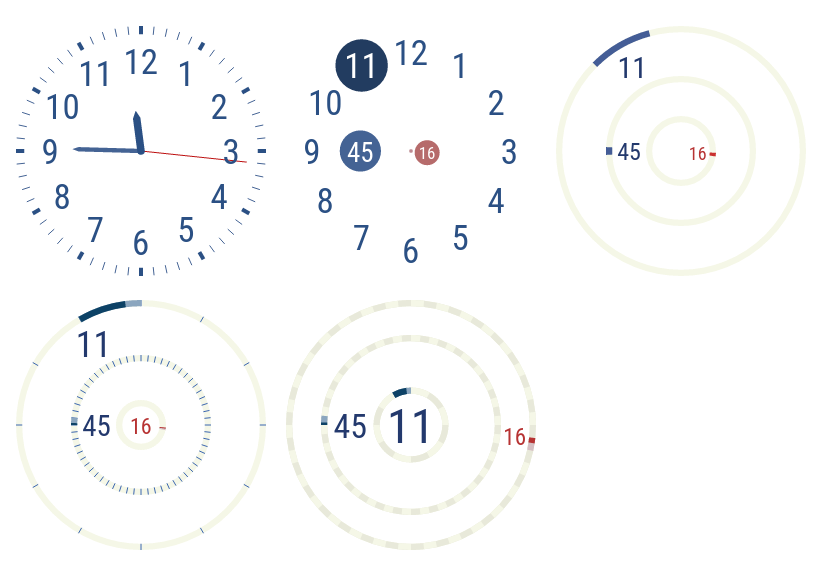

# Clock faces

## Experimental clock faces combining rotary and digital design

A rotary clock hand shows the hour by pointing to one of 12 sectors
of a circle. Another hand shows the minute by pointing to one of 60
sectors. Each unit of time is indicated by a location on the circle. A
user can glance at the location to get a feel for the time. Even if the
clock face is fuzzy or seen at a distance, we can get a rough idea of
the time.

A digital clock always shows the hour in the same location, spelling it
out with digits. The minute is also spelled out with digits in a fixed
location. The user identifies the digits and evaluates them arithmetically
to work out the exact time.

Why don't we combine these two modes of expression? Let's display each
unit of time with digits rendered at a time-dependent location on a
circular clock face. The location on the circle shows the value visually
and approximately, while the digits state the value textually and exactly.

